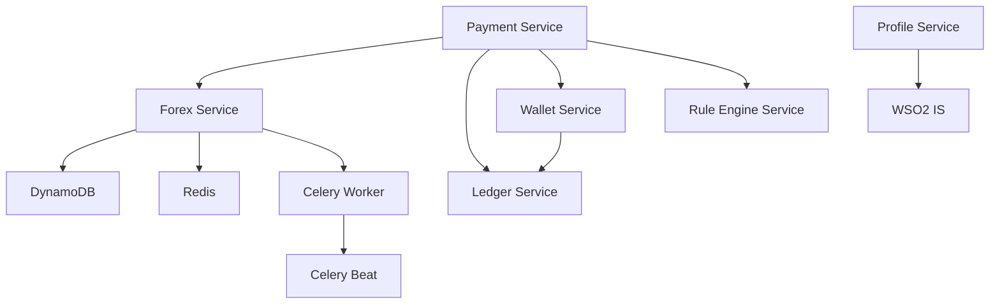

# WSO2 Payment Services Platform

A comprehensive microservices-based payment platform integrating **WSO2 Identity Server** (OAuth2/OIDC) and **WSO2 API Manager** with modern observability, distributed tracing, and event-driven architecture.

## 📋 Table of Contents

- [Overview](#overview)
- [Architecture](#architecture)
- [Technology Stack](#technology-stack)
- [Project Structure](#project-structure)
- [Prerequisites](#prerequisites)
- [Quick Start](#quick-start)
- [Service Details](#service-details)
- [Configuration](#configuration)
- [TLS/SSL Setup](#tlsssl-setup)
- [Scripts & Automation](#scripts--automation)
- [Monitoring & Observability](#monitoring--observability)
- [Development](#development)
- [Troubleshooting](#troubleshooting)
- [Additional Documentation](#additional-documentation)

---

## 🎯 Overview

This platform provides a complete payment processing ecosystem with:

- **7 Microservices**: Banking, Forex, Ledger, Payment, Profile, Rule Engine, and Wallet
- **WSO2 Integration**: Centralized identity management and API gateway
- **Business Rules Engine**: GoRules BRMS for decision management
- **Event-Driven Architecture**: Kafka-compatible event streaming (Redpanda)
- **Distributed Tracing**: OpenTelemetry + Jaeger for complete observability
- **Production-Ready**: Health checks, monitoring, graceful shutdowns

### Key Features

✅ OAuth2/OIDC authentication via WSO2 Identity Server  
✅ API Gateway management with WSO2 API Manager  
✅ Business rules management with GoRules BRMS  
✅ Real-time forex rate updates with Celery background workers  
✅ Double-entry ledger system for financial transactions  
✅ Distributed caching with Redis  
✅ Event sourcing with Kafka (Redpanda)  
✅ Comprehensive observability (traces, metrics, logs)  
✅ TLS/mTLS security with automatic certificate management  

---

## 🏗️ Architecture

### System Components

```
┌─────────────────────────────────────────────────────────────────┐
│                        🌐 WSO2 Layer                            │
│  ┌──────────────────────┐      ┌──────────────────────┐        │
│  │  WSO2 API Manager    │      │  WSO2 Identity Server│        │
│  │  Port: 9443          │◄────►│  Port: 9444          │        │
│  │  • API Gateway       │      │  • OAuth2/OIDC       │        │
│  │  • Developer Portal  │      │  • User Management   │        │
│  │  • Publisher Portal  │      │  • Token Issuance    │        │
│  └──────────────────────┘      └──────────────────────┘        │
└─────────────────────────────────────────────────────────────────┘
                              │
                              ▼
┌─────────────────────────────────────────────────────────────────┐
│                     📦 Microservices Layer                      │
│                                                                 │
│  ┌──────────┐  ┌──────────┐  ┌──────────┐  ┌──────────┐      │
│  │ Banking  │  │  Forex   │  │  Ledger  │  │ Payment  │      │
│  │  :8007   │  │  :8001   │  │  :8002   │  │  :8003   │      │
│  └──────────┘  └──────────┘  └──────────┘  └──────────┘      │
│                                                                 │
│  ┌──────────┐  ┌──────────┐  ┌──────────┐                    │
│  │ Profile  │  │Rule Eng. │  │  Wallet  │                    │
│  │  :8004   │  │  :8005   │  │  :8006   │                    │
│  └──────────┘  └──────────┘  └──────────┘                    │
└─────────────────────────────────────────────────────────────────┘
                              │
                              ▼
┌─────────────────────────────────────────────────────────────────┐
│                   🗄️  Data & Message Layer                      │
│                                                                 │
│  ┌────────────┐  ┌──────────┐  ┌──────────┐  ┌──────────┐    │
│  │ PostgreSQL │  │  Redis   │  │ DynamoDB │  │ Redpanda │    │
│  │   :5432    │  │  :6379   │  │  :8000   │  │  :9092   │    │
│  └────────────┘  └──────────┘  └──────────┘  └──────────┘    │
└─────────────────────────────────────────────────────────────────┘
                              │
                              ▼
┌─────────────────────────────────────────────────────────────────┐
│              📊 Observability Layer                             │
│                                                                 │
│  ┌──────────────────┐       ┌──────────────────┐              │
│  │  Jaeger UI       │       │  OTel Collector  │              │
│  │  :16686          │◄──────│  :4318 (HTTP)    │              │
│  │  (Tracing)       │       │  :4317 (gRPC)    │              │
│  └──────────────────┘       └──────────────────┘              │
└─────────────────────────────────────────────────────────────────┘
```

### Service Dependencies



---

## 🛠️ Technology Stack

### Backend Services
- **Language**: Python 3.12
- **Framework**: FastAPI 0.119+
- **ASGI Server**: Uvicorn
- **Database ORM**: psycopg3 (async PostgreSQL)
- **Task Queue**: Celery 5.4+ with Redis backend

### Identity & API Management
- **WSO2 Identity Server**: v7.1.0 (OAuth2, OIDC, SCIM2)
- **WSO2 API Manager**: v4.5.0 (API Gateway, Publisher, DevPortal)

### Databases & Caching
- **PostgreSQL**: v18.0 (relational data, 200 max connections)
- **Redis**: v8.2 (caching, session storage, Celery broker)
- **DynamoDB Local**: v2.x (forex rates storage)

### Messaging & Events
- **Redpanda**: v25.2 (Kafka-compatible streaming)

### Observability
- **OpenTelemetry**: Instrumentation + Collector
- **Jaeger**: Distributed tracing UI
- **Structured Logging**: structlog + python-json-logger

### Security
- **TLS/mTLS**: mkcert for local development
- **Authentication**: OAuth2 with JWT tokens
- **Secrets**: python-jose, PyJWT, passlib

### Infrastructure
- **Container Runtime**: Docker + Docker Compose
- **Base Images**: Ubuntu Noble (24.04 LTS), Alpine, Temurin JDK 17

---

## 📁 Project Structure

```
/home/premnath/application/
│
├── 📄 docker-compose.yml          # Main orchestration file
├── 📄 .env                         # Environment configuration
│
├── 📂 app_services/                # Microservices source code
│   ├── common/                     # Shared utilities & config
│   │   ├── auth/                   # Authentication helpers
│   │   ├── config.py               # Centralized configuration
│   │   ├── middleware.py           # CORS & request middleware
│   │   ├── utils.py                # Redis, DynamoDB, helpers
│   │   └── requirements.txt        # Shared dependencies
│   │
│   ├── banking_service/            # Bank account linking (Mastercard)
│   │   ├── app/
│   │   │   ├── main.py             # FastAPI application
│   │   │   ├── config.py           # Service configuration
│   │   │   ├── api/v1/             # API endpoints
│   │   │   └── services/           # Mastercard Open Finance integration
│   │   ├── Dockerfile
│   │   └── requirements.txt
│   │
│   ├── forex_service/              # Currency exchange rates
│   │   ├── app/
│   │   │   ├── main.py             # FastAPI application
│   │   │   ├── celery_app.py       # Background worker setup
│   │   │   └── tasks.py            # Periodic rate fetching
│   │   ├── Dockerfile
│   │   └── requirements.txt
│   │
│   ├── ledger_service/             # Double-entry accounting
│   ├── payment_service/            # Payment orchestration
│   ├── profile_service/            # User profile management
│   ├── rule_engine_service/        # Business rules engine
│   └── wallet_service/             # Digital wallet operations
│
├── 📂 app_scripts/                 # Initialization scripts
│   └── init_dynamodb.sh            # DynamoDB table creation
│
├── 📂 scripts/                     # Automation & tooling (44 commands total)
│   ├── wso2-toolkit.sh             # WSO2 management (19 commands)
│   ├── api-manager.sh              # API lifecycle (10 commands)
│   ├── wso2is-user.sh              # User management (8 commands)
│   └── complete-workflow-test.sh   # Automated E2E test
│
├── 📂 wso2am/                      # API Manager configuration
│   ├── Dockerfile
│   ├── lib/                        # PostgreSQL JDBC driver
│   └── repository/
│       ├── conf/deployment.toml    # APIM configuration
│       └── resources/security/     # Keystores & truststores
│
├── 📂 wso2is/                      # Identity Server configuration
│   ├── Dockerfile
│   ├── lib/                        # PostgreSQL JDBC driver
│   └── repository/
│       ├── conf/deployment.toml    # IS configuration
│       ├── components/dropins/     # Custom event handlers
│       └── resources/security/     # PKCS12 keystores
│
├── 📂 conf/                        # Additional configuration
│   └── postgres/
│       └── scripts/
│           └── 00-init-all.sql     # Database initialization
│
├── 📂 certs/                       # TLS certificates
│   ├── rootCA.pem                  # mkcert root CA
│   ├── shared.pem                  # Shared certificate
│   ├── shared-key.pem              # Private key
│   └── shared.p12                  # PKCS12 bundle
│
├── 📂 otel/                        # OpenTelemetry configuration
│   ├── Dockerfile
│   └── collector.yaml              # OTel Collector config
│
└── 📄 Documentation
    ├── README.md                   # This file (overview & quick start)
    ├── WORKFLOW_GUIDE.md           # Complete command reference & workflows
    ├── TLS-Setup.md                # Certificate setup guide
    └── WSO2_Architecture.md        # WSO2 integration details
```

---

## ✅ Prerequisites

### Required Software

- **Docker**: v24.0+ ([Install Docker](https://docs.docker.com/get-docker/))
- **Docker Compose**: v2.20+ (usually bundled with Docker)
- **curl**: For API testing
- **jq**: JSON processor (`sudo apt install jq` or `brew install jq`)
- **Python 3**: For running scripts (v3.8+)

### System Requirements

- **RAM**: Minimum 8GB (16GB recommended)
- **CPU**: 4+ cores recommended
- **Disk**: 10GB free space
- **OS**: Linux, macOS, or Windows with WSL2

### Network Ports

Ensure these ports are available:

| Service | Port(s) | Description |
|---------|---------|-------------|
| PostgreSQL | 5432 | Database |
| Redis | 6379 | Cache & broker |
| DynamoDB Local | 8000 | NoSQL store |
| Redpanda | 9092, 9644, 8082 | Kafka API |
| WSO2 AM | 9443, 8280, 8243 | API Manager |
| WSO2 IS | 9444, 9764 | Identity Server |
| Banking Service | 8007 | Bank linking |
| Forex Service | 8001 | Currency rates |
| Ledger Service | 8002 | Accounting |
| Payment Service | 8003 | Payments |
| Profile Service | 8004 | User profiles |
| Rule Engine | 8005 | Business rules |
| Wallet Service | 8006 | Wallets |
| Jaeger UI | 16686 | Tracing dashboard |
| OTel Collector | 4317, 4318 | Telemetry |

---

## 🚀 Quick Start

### 1. Clone & Configure

```bash
# Clone the repository (if not already done)
cd /home/premnath/application

# Review and update environment variables
cp .env.example .env  # If .env doesn't exist
vim .env
```

### 2. TLS Certificate Setup

**IMPORTANT**: Must be done before first startup!

```bash
# Generate mkcert certificates
mkdir -p certs

# Create root CA and shared certificate
docker compose run --rm --entrypoint sh mkcert -lc '
  mkcert -install &&
  mkcert -cert-file /certs/shared.pem -key-file /certs/shared-key.pem \
         am.local is.local wso2am wso2is localhost 127.0.0.1 &&
  cp "$(mkcert -CAROOT)/rootCA.pem" /certs/rootCA.pem
'

# Take ownership of certificates
sudo chown -R "$(id -u)":"$(id -g)" certs

# Convert to PKCS12 format
docker run --rm -v "$PWD:/work" -w /work alpine:3.20 sh -lc '
  apk add --no-cache openssl &&
  openssl pkcs12 -export \
    -in certs/shared.pem -inkey certs/shared-key.pem \
    -certfile certs/rootCA.pem \
    -name wso2carbon \
    -out certs/shared.p12 \
    -passout pass:wso2carbon
'
```

See [TLS-Setup.md](TLS-Setup.md) for complete instructions.

### 3. Start Infrastructure

```bash
# Start all services
docker compose up -d --build

# Monitor startup logs
docker compose logs -f

# Check service health
docker compose ps
```

### 4. Initialize WSO2

```bash
# Wait ~60 seconds for WSO2 IS OSGi bundles to fully initialize
sleep 60

# Run health check
./scripts/wso2-toolkit.sh health

# Setup Key Manager
./scripts/wso2-toolkit.sh setup-km

# Check MTLS certificates
./scripts/wso2-toolkit.sh check-mtls

# Create default roles
./scripts/wso2-toolkit.sh create-roles
```

**For complete workflow**, see [WORKFLOW_GUIDE.md](WORKFLOW_GUIDE.md)

### 5. Verify Services

```bash
# Check microservice health
curl http://localhost:8007/health  # Banking
curl http://localhost:8001/health  # Forex
curl http://localhost:8002/health  # Ledger
curl http://localhost:8003/health  # Payment
curl http://localhost:8004/health  # Profile
curl http://localhost:8005/health  # Rule Engine
curl http://localhost:8006/health  # Wallet

# Access WSO2 consoles
# API Manager: https://localhost:9443/carbon (admin/admin)
# Identity Server: https://localhost:9444/carbon (admin/admin)
# Jaeger UI: http://localhost:16686
```

---

## 🔧 Service Details

### 1️⃣ Banking Service (Port 8007)

**Purpose**: Bank account linking and data aggregation

**Features**:
- Mastercard Open Finance integration (formerly Finicity)
- Bank account connection and verification
- Transaction data aggregation
- Account balance retrieval
- Redis caching for tokens and data
- DynamoDB storage for connection metadata

**Endpoints**:
- `GET /health` - Health check
- `POST /v1/bank-accounts/connect` - Initiate bank connection
- `GET /v1/bank-accounts/{id}` - Get account details
- `GET /v1/bank-accounts/{id}/transactions` - Fetch transactions
- `GET /v1/bank-accounts/{id}/balance` - Get account balance

**Configuration** (`.env`):
```bash
MASTERCARD_PARTNER_ID=your_partner_id
MASTERCARD_PARTNER_SECRET=your_partner_secret
MASTERCARD_APP_KEY=your_app_key
MASTERCARD_API_BASE_URL=https://api.finicity.com
ENCRYPTION_KEY=your-32-character-encryption-key
```

### 2️⃣ Forex Service (Port 8001)

**Purpose**: Real-time currency exchange rate management

**Features**:
- Real-time forex rate fetching from OANDA API
- DynamoDB storage for rates
- Redis caching (5-hour TTL)
- Celery workers for background updates
- Celery Beat for scheduled tasks

**Endpoints**:
- `GET /health` - Health check
- `GET /rates/{pair}` - Get exchange rate (e.g., USDINR)
- `POST /convert` - Currency conversion

**Configuration** (`.env`):
```bash
OANDA_API_BASE=https://exchange-rates-api.oanda.com/v2
OANDA_API_KEY=your_api_key_here
PAIRS_CSV=USDINR,EURINR,GBPINR
```

### 3️⃣ Ledger Service (Port 8002)

**Purpose**: Double-entry accounting system

**Features**:
- ACID-compliant transaction recording
- PostgreSQL for persistent storage
- Event publishing to Kafka
- OpenTelemetry tracing

**Database**: `ledger_db` (PostgreSQL)

### 4️⃣ Payment Service (Port 8003)

**Purpose**: Payment orchestration and processing

**Dependencies**:
- Forex Service (currency conversion)
- Ledger Service (transaction recording)
- Wallet Service (balance management)
- Rule Engine (business validation)

**Database**: `payment_db` (PostgreSQL)

### 5️⃣ Profile Service (Port 8004)

**Purpose**: User profile and identity management

**Integration**:
- WSO2 Identity Server (OAuth2 validation)
- SCIM2 API for user operations

**Environment**:
```bash
WSO2_IS_URL=https://wso2is:9443
```

**Database**: `profile_db` (PostgreSQL)

### 6️⃣ Rule Engine Service (Port 8005)

**Purpose**: Centralized business rules evaluation

**Use Cases**:
- Transaction limits
- Fraud detection rules
- Compliance checks

**Database**: `rule_engine_db` (PostgreSQL)

### 7️⃣ Wallet Service (Port 8006)

**Purpose**: Digital wallet operations

**Features**:
- Balance management
- Transaction history
- Integration with Ledger Service

**Database**: `wallet_db` (PostgreSQL)

---

## ⚙️ Configuration

### Environment Variables (.env)

```bash
# PostgreSQL
POSTGRES_PASSWORD=postgres
POSTGRES_USER=postgres
POSTGRES_DB=postgres
POSTGRES_MAX_CONNECTIONS=200

# SMTP (for notifications)
SMTP_HOST=smtp.gmail.com
SMTP_PORT=587
SENDER_EMAIL=your-email@gmail.com
SENDER_PASSWORD=your-app-password

# OANDA Forex API
OANDA_API_BASE=https://exchange-rates-api.oanda.com/v2
OANDA_API_KEY=your_oanda_api_key

# Redis
REDIS_PASSWORD=redis-secret

# WSO2 Credentials
WSO2_ADMIN_USERNAME=admin
WSO2_ADMIN_PASSWORD=admin
```

### Database Initialization

All databases are auto-created via:
```
conf/postgres/scripts/00-init-all.sql
```

Creates:
- WSO2 databases: `apim_db`, `identity_db`, `shared_db`
- Service databases: `banking_db`, `forex_db`, `ledger_db`, `payment_db`, `profile_db`, `rule_engine_db`, `wallet_db`

---

## 🔐 TLS/SSL Setup

### Certificate Structure

- **mkcert Root CA**: Self-signed CA for local development
- **Shared Certificate**: Single cert for all services
- **SANs**: `am.local`, `is.local`, `wso2am`, `wso2is`, `localhost`, `127.0.0.1`

### WSO2 Keystore Formats

| Component | Format | File |
|-----------|--------|------|
| WSO2 AM | JKS | `wso2carbon.jks` |
| WSO2 AM Truststore | JKS | `client-truststore.jks` |
| WSO2 IS | PKCS12 | `wso2carbon.p12` |
| WSO2 IS Truststore | PKCS12 | `client-truststore.p12` |

### Verification

```bash
# Test HTTPS endpoints
curl --cacert certs/rootCA.pem https://localhost:9443/services/
curl --cacert certs/rootCA.pem https://localhost:9444/oauth2/jwks

# Container-to-container (mTLS)
docker exec wso2am curl -s https://is.local:9443/oauth2/jwks
docker exec wso2is curl -s https://am.local:9443/services/
```

Full guide: [TLS-Setup.md](TLS-Setup.md)

---

## 📜 Scripts & Automation

### Quick Command Reference

**wso2-toolkit.sh** - Complete WSO2 management (19 commands)
```bash
# Infrastructure
./scripts/wso2-toolkit.sh health              # Health check
./scripts/wso2-toolkit.sh setup-km             # Setup Key Manager
./scripts/wso2-toolkit.sh check-mtls           # Check MTLS
./scripts/wso2-toolkit.sh fix-mtls             # Fix MTLS issues

# Applications
./scripts/wso2-toolkit.sh create-app MyApp    # Create OAuth2 app
./scripts/wso2-toolkit.sh list-apps            # List all apps
./scripts/wso2-toolkit.sh get-app-keys <id>   # Get OAuth2 credentials

# Roles
./scripts/wso2-toolkit.sh create-roles        # Create default roles
./scripts/wso2-toolkit.sh list-roles           # List all roles

# Tokens (8 grant types supported)
./scripts/wso2-toolkit.sh get-token cc <client_id> <secret>
./scripts/wso2-toolkit.sh get-token password <client_id> <secret> <user> <pass>
./scripts/wso2-toolkit.sh get-token refresh <client_id> <secret> <refresh_token>
```

**api-manager.sh** - API lifecycle management (10 commands)
```bash
./scripts/api-manager.sh create-api <name> <version> <context> <backend>
./scripts/api-manager.sh deploy-api <api_id>
./scripts/api-manager.sh quick-deploy <name> <version> <context> <backend>
./scripts/api-manager.sh subscribe <app_id> <api_id>
./scripts/api-manager.sh list-subscriptions <app_id> app
```

**wso2is-user.sh** - User management (8 commands)
```bash
./scripts/wso2is-user.sh register <user> <pass> <email>
./scripts/wso2is-user.sh activate-user <username>
./scripts/wso2is-user.sh login <user> <pass> <client_id> <secret>
./scripts/wso2is-user.sh list-users
```

**complete-workflow-test.sh** - Automated end-to-end test
```bash
./scripts/complete-workflow-test.sh           # Full workflow automation
```

**📖 For detailed command documentation, see [WORKFLOW_GUIDE.md](WORKFLOW_GUIDE.md)**

### init_dynamodb.sh

DynamoDB table initialization:
- Creates `fx_rates` table
- Verifies table creation
- Runs automatically on startup

---

## 📊 Monitoring & Observability

### OpenTelemetry Configuration

**Instrumentation**: All services auto-instrumented

**Collector Pipeline**:
```yaml
receivers: [otlp]
processors: [memory_limiter, batch]
exporters: [otlp, debug]
```

**Endpoints**:
- HTTP: `http://otel-collector:4318`
- gRPC: `http://otel-collector:4317`

### Jaeger Tracing

**Access**: http://localhost:16686

**Features**:
- Distributed trace visualization
- Service dependency graph
- Latency analysis
- Error tracking

**Service Names**:
- `banking-service`
- `forex-service`
- `ledger-service`
- `payment-service`
- `profile-service`
- `rule-engine-service`
- `wallet-service`

### Health Checks

```bash
# Docker Compose health status
docker compose ps

# Individual service health endpoints
for port in 8007 8001 8002 8003 8004 8005 8006; do
  echo "Service on port $port:"
  curl -s http://localhost:$port/health | jq .
done

# WSO2 component health
./scripts/wso2-toolkit.sh health
```

### Logs

```bash
# All services
docker compose logs -f

# Specific service
docker compose logs -f forex-service
docker compose logs -f wso2am
docker compose logs -f postgres

# Tail last 200 lines
docker logs wso2is --tail 200
```

---

## 💻 Development

### Adding a New Service

1. **Create service directory**:
   ```bash
   mkdir -p app_services/new_service/app
   ```

2. **Create Dockerfile**:
   ```dockerfile
   FROM ubuntu:noble
   # ... (follow existing service pattern)
   COPY ./common /app/common
   COPY ./new_service/app /app/app
   ```

3. **Add to docker-compose.yml**:
   ```yaml
   new-service:
     build:
       context: ./app_services
       dockerfile: new_service/Dockerfile
     environment:
       - SERVICE_NAME=new_service
       - DATABASE_URL=postgresql://...
     depends_on:
       - postgres
       - redis
   ```

4. **Create database** in `conf/postgres/scripts/00-init-all.sql`:
   ```sql
   CREATE DATABASE new_service_db;
   ```

### Local Development

```bash
# Rebuild single service
docker compose up -d --build forex-service

# Run service locally (outside Docker)
cd app_services/forex_service
python -m venv venv
source venv/bin/activate
pip install -r requirements.txt -r ../common/requirements.txt
DATABASE_URL=postgresql://... python -m app.main

# Run tests
pytest
```

### Code Structure

**Common Utilities** (`app_services/common/`):
- `config.py`: Centralized configuration
- `utils.py`: Redis, DynamoDB, date helpers
- `middleware.py`: CORS, request logging
- `auth/`: JWT validation, OAuth2 helpers

**Service Pattern**:
```python
# app/main.py
from fastapi import FastAPI
from common.middleware import add_cors_middleware
from common.config import config

app = FastAPI()
add_cors_middleware(app)

@app.get("/health")
async def health():
    return {"status": "healthy"}
```

---

## 🐛 Troubleshooting

### Common Issues

#### 1. WSO2 IS "AuthenticatorRegistry.authTracker is null"

**Cause**: Accessed WSO2 IS before OSGi bundles fully initialized

**Solution**:
```bash
# Wait 60 seconds after "started" message
docker logs wso2is | grep "started"
sleep 60
./scripts/wso2-toolkit.sh health
```

#### 2. Celery Workers Not Running

**Check**:
```bash
docker compose logs fx-worker
docker exec fx-worker celery -A app.celery_app.celery_app inspect ping
```

**Fix**:
```bash
docker compose restart fx-worker fx-beat
```

#### 3. Database Connection Errors

**Verify PostgreSQL health**:
```bash
docker compose ps postgres
docker exec postgres pg_isready -U postgres -d postgres
```

**Check connection string**:
```bash
docker compose logs forex-service | grep -i database
```

#### 4. Certificate Errors (TLS)

**Re-generate certificates**:
```bash
# Remove existing keystores
rm -f wso2am/repository/resources/security/*.jks
rm -f wso2is/repository/resources/security/*.p12

# Follow TLS setup again
# See TLS-Setup.md
```

**Verify keystores**:
```bash
file wso2am/repository/resources/security/wso2carbon.jks
file wso2is/repository/resources/security/wso2carbon.p12
```

#### 5. Port Already in Use

**Find process**:
```bash
sudo lsof -i :9443  # Example for WSO2 AM
```

**Stop conflicting services**:
```bash
docker compose down
# Kill process if necessary
kill -9 <PID>
```

### Debug Mode

**Enable verbose logging**:

```yaml
# docker-compose.yml
environment:
  - JAVA_OPTS=-Xms512m -Xmx2048m -Dlog4j.debug=true
  - LOG_LEVEL=DEBUG
```

**Python services**:
```python
# app/main.py
logging.basicConfig(level=logging.DEBUG)
```

---

## 📚 Additional Documentation

### Project Documentation
- **[WORKFLOW_GUIDE.md](WORKFLOW_GUIDE.md)**: Complete step-by-step workflow guide with all commands
- **[TLS-Setup.md](TLS-Setup.md)**: Certificate setup and configuration
- **[WSO2_Architecture.md](WSO2_Architecture.md)**: Detailed WSO2 integration architecture

### WSO2 Official Documentation

- [WSO2 API Manager 4.5.0](https://apim.docs.wso2.com/en/4.5.0/)
- [WSO2 Identity Server 7.1.0](https://is.docs.wso2.com/en/7.1.0/)

### External Resources

- [FastAPI Documentation](https://fastapi.tiangolo.com/)
- [OpenTelemetry Python](https://opentelemetry.io/docs/instrumentation/python/)
- [Celery Documentation](https://docs.celeryq.dev/)
- [Redpanda Documentation](https://docs.redpanda.com/)

---

## 🤝 Contributing

### Development Workflow

1. Create feature branch
2. Make changes
3. Test locally with Docker Compose
4. Update documentation if needed
5. Submit pull request

### Coding Standards

- **Python**: PEP 8, type hints, async/await where applicable
- **Docker**: Multi-stage builds, minimal layers, security scanning
- **Documentation**: Update README for architectural changes

---

## 📝 License

[Specify your license here]

---

## 🆘 Support

For issues or questions:
1. Check [Troubleshooting](#troubleshooting) section
2. Review Docker logs: `docker compose logs <service>`
3. Verify environment configuration in `.env`
4. Consult [WSO2 documentation](https://wso2.com/docs/)

---

## 🎯 Roadmap

- [ ] Add API documentation (Swagger/OpenAPI)
- [ ] Implement rate limiting
- [ ] Add integration tests
- [ ] Kubernetes manifests (Helm charts)
- [ ] CI/CD pipeline (GitHub Actions/GitLab CI)
- [ ] Production deployment guide
- [ ] Performance benchmarks

---

**Last Updated**: 2025-01-30  
**Version**: 1.0.0  
**Maintainer**: Premnath
